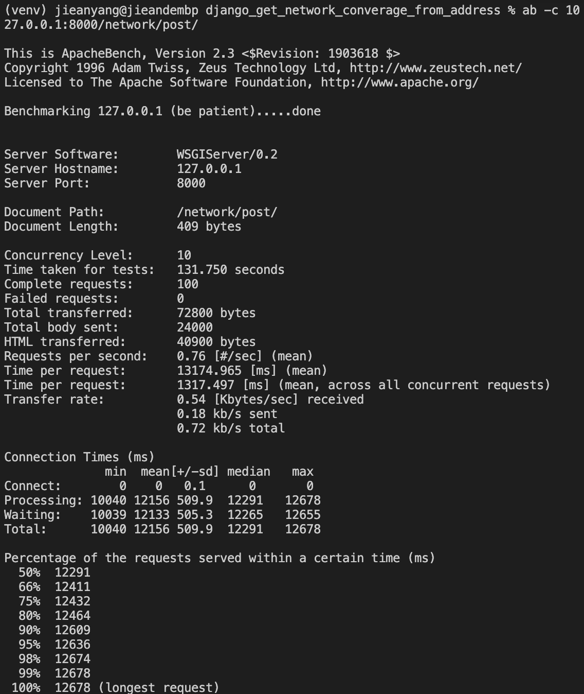
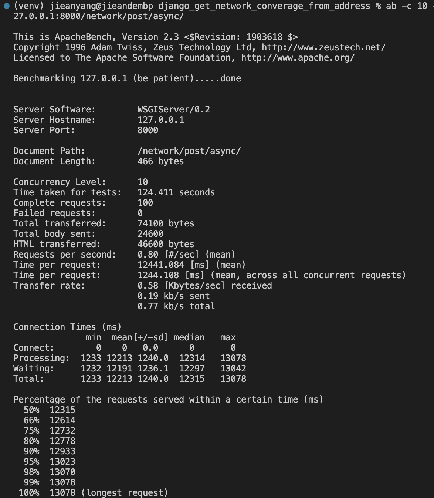

# django_get_network_converage_from_address

## Commands

```bash
# Creat project
django-admin startproject [projectName]
# Create app
python manage.py startapp [appName]
```

### Packages

```
pip install djangorestframework
```

## Goal

input

```json
// This input have not relations with the raw_network_coverage_data.csv
// The waiting time will be long if you use whole raw_network_coverage_data.csv data
// {
//   "id1": "157 boulevard Mac Donald 75019 Paris",
//   "id4": "5 avenue Anatole France 75007 Paris",
//   "id5": "1 Bd de Parc, 77700 Coupvray",
//   "id6": "Place d'Armes, 78000 Versailles",
//   "id7": "17 Rue René Cassin, 51430 Bezannes",
//   "id8": "78 Le Poujol, 30125 L'Estréchure"
// }

// Try to test this input
{
  "id1": "CHEZ BREVAL, 29242 Ouessant", // Ok
  "id2": "157 boulevard Mac Donald 75019 Paris" // No operators
}
```

process:

- Read CSV file, know the coverage measure info of each opeartion for hold places
- Get address, sen to gouv api know the location
- Check every location(lat, lng) if they in coverage 2G, 3G, 4G of every operation (orange, SFR, boygues)

output:

```json
{
  "id1": {
    "orange": { "2G": true, "3G": true, "4G": false },
    "SFR": { "2G": true, "3G": true, "4G": true },
    "bouygues": { "2G": true, "3G": true, "4G": false }
  },
  "id4": {
    "orange": { "2G": true, "3G": true, "4G": false },
    "bouygues": { "2G": true, "3G": false, "4G": false },
    "SFR": { "2G": true, "3G": true, "4G": false }
  }
  // ...
}
```

## Test

### Comparison Async vs sync

#### Performance for sync:

```bash
ab -c 10 -n 100 -p test_input_post_data.json -T application/json http://127.0.0.1:8000/network/post/

```



#### Performance for Async:

```bash
ab -c 10 -n 100 -p test_input_post_data.json -T application/json http://127.0.0.1:8000/network/post/async/
```



### Conclusion

- The difference between the results of the Async and Sync methods is not large; Sometimes Sync takes about the same amount of time as Async, mainly because most of our code requires intensive computation.
- Another reason is the Aysnc is not multithread, and cannot take advantage of the computational power of multi-core CPUs.

### Optimisation

Single user requests take longer, but the server can handle requests well under concurrent conditions. We can continue to optimize:

- Use `aiohttp` instaed of `requests.get`
- Reduced loops
- `lamber93_to_gps` function is computationally intensive, consider pre-calcutating all the x, y in thefile into coordinate information. Sinci in real life, this information generally doesn't change very often.

## Resouce

- [link](https://papernest.notion.site/Backend-developer-technical-test-a6175cee063e438ca0ed229645957e29)
